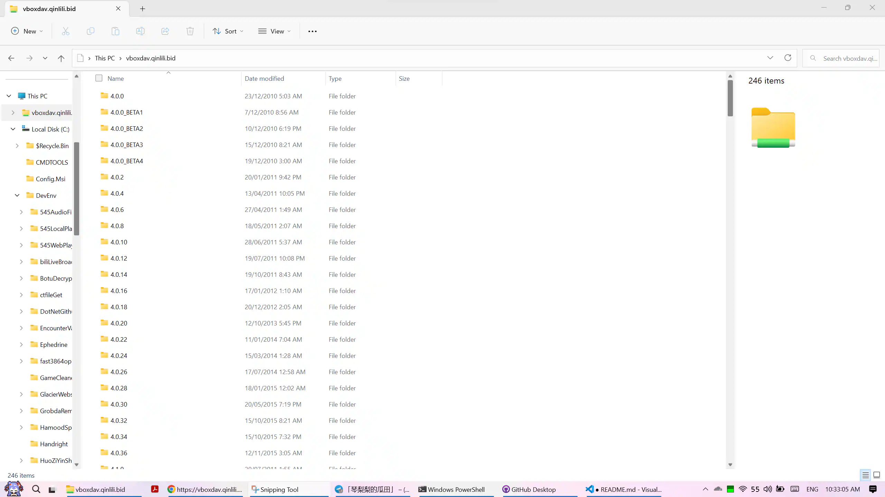

# 用WebDAV来下载VirtualBox安装包吧

## 项目介绍
`你说得对，但virtualbox-download-webdav-workers是一款由琴梨梨开发的WebDAV服务器，在这个名为WebDAV的世界里，你将扮演一位名为资源管理器的程序，在浏览中邂逅各式各样的文件，和它们一起击败运营商，同时逐步发现Github的真相。`  
厌倦了VirtualBox官方网页下载丑陋简单的界面？那就用WebDAV来下载吧！本项目通过Cloudflare Workers将官方的下载网页转换为WebDAV协议，并映射到官方下载地址  
  

## 公共服务地址
vboxdav.qinlili.bid  
`试运行期间本服务免费提供，若后期访问量过高爆了我的免费API额度则会加以限制，请勿滥用本服务`

### 如何使用
在任何支持WebDAV的程序内填写`https://vboxdav.qinlili.bid`即可，若需要选择用户名请选择匿名  
已测试的客户端包括Windows资源管理器，MT管理器，Solid Explorer  
请不要在浏览器内直接访问该地址， 这不会得到任何有用的信息，WebDAV协议并未要求在浏览器内展示人类友好的界面，出于偷懒本项目未和其他WebDAV服务端一样额外实现浏览器访问界面  

## 技术细节
本项目通过直接访问官方下载网页并直接通过字符串分割解析（Workers没有DOMParser支持），然后直接用拼接字符串办法构建WebDAV标准的XML返回  
整个项目实现非常的简陋且扭曲，没有使用任何依赖库，但是能跑，钻木取火也能点着不是么  

## 开源协议
本项目使用AGPL3.0协议开源  
该协议允许商用，但即使部署在在线服务器上也需要向用户提供源码  
你可以在遵守该协议的情况下使用本项目二次开发，无需通知琴梨梨  
琴梨梨保留对违反协议使用的用户诉讼的权利  